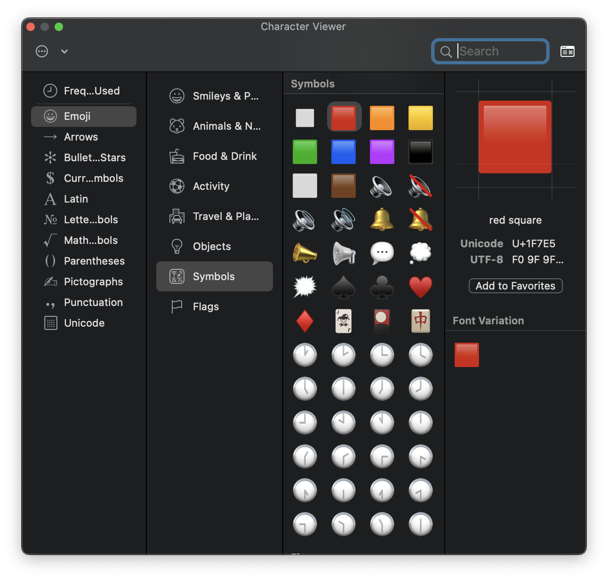
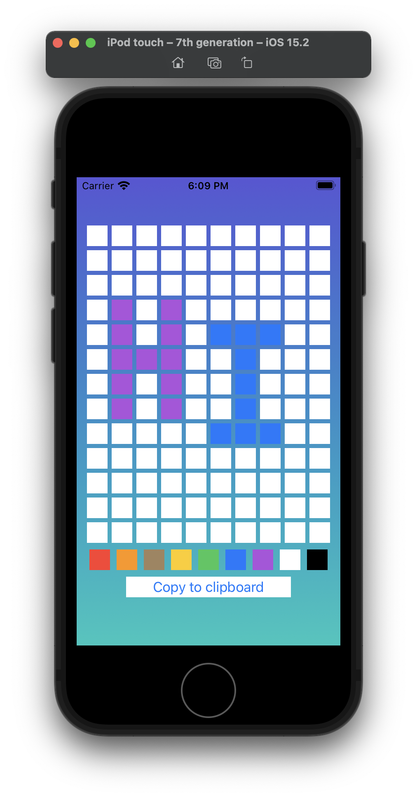
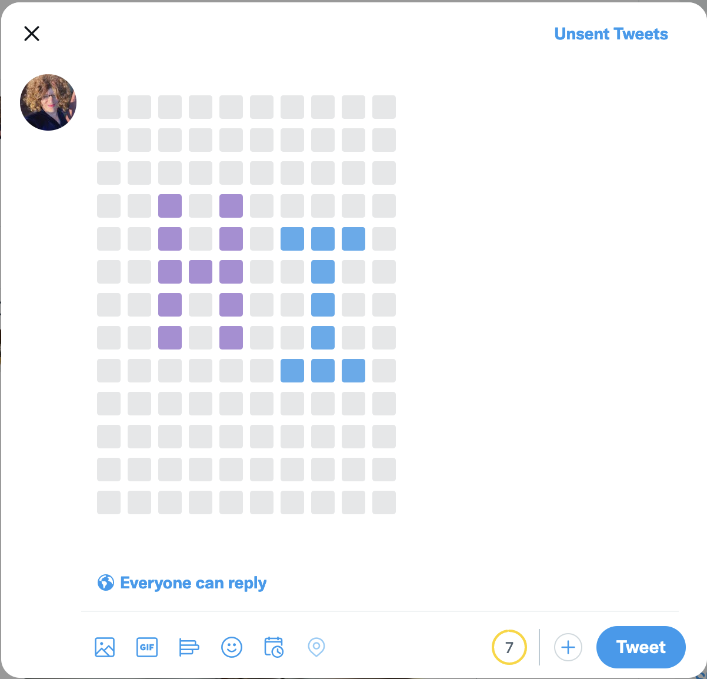

# iEmojiPainter

This is just a silly idea that I came up with one day to allow myself to "paint" a picture and then copy and paste it into Twitter. As of Unicode 12.0, there are now emoji shaped like a square and that come in various colors, namely, 🟥, 🟧, 🟫, 🟨, 🟩, 🟦, 🟪, ⬛️, and ⬜️. I immediately thought of being able to use them to make old-school pixellated pictues like I did in this Twitter thread of Ms. Pac-Man sprites: https://twitter.com/quephird/status/1193081318763945985?s=20

However, using the Character applet to pick those characters:

... and "draw" them into a tweet became really tedious and I wondered if I could make a painting-like app in iOS to faciliate making pictures. Instead, I made this app to present a super lo-fi MSPaint like interface:

It's really simple to use; the canvas is the grid of initially white squares. The paint toolbar allows you to select a color to paint with, and after tapping on any one of the colors, you can then tap any of the white squares to set their color. Then when you've completed making your picture, you can tap on the Copy to clipboard button and then paste in the emoji into a tweet editor:

Note that the maximum tweet size is 280 "normal" characters, and with these emoji, that results in a maximum picture size of 10x13 "pixels".

